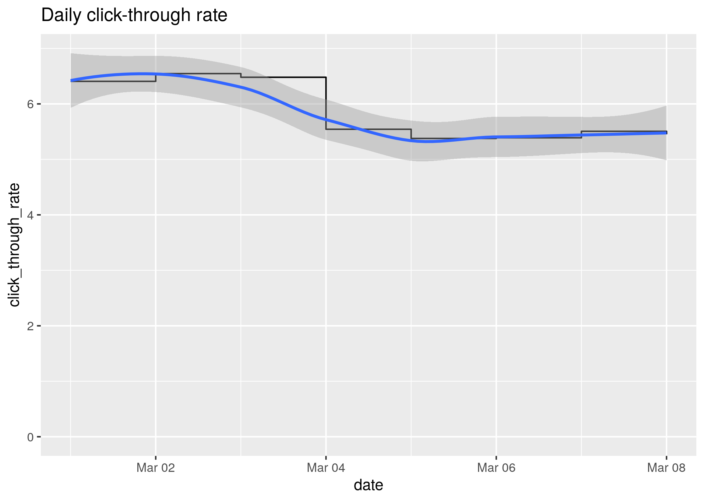
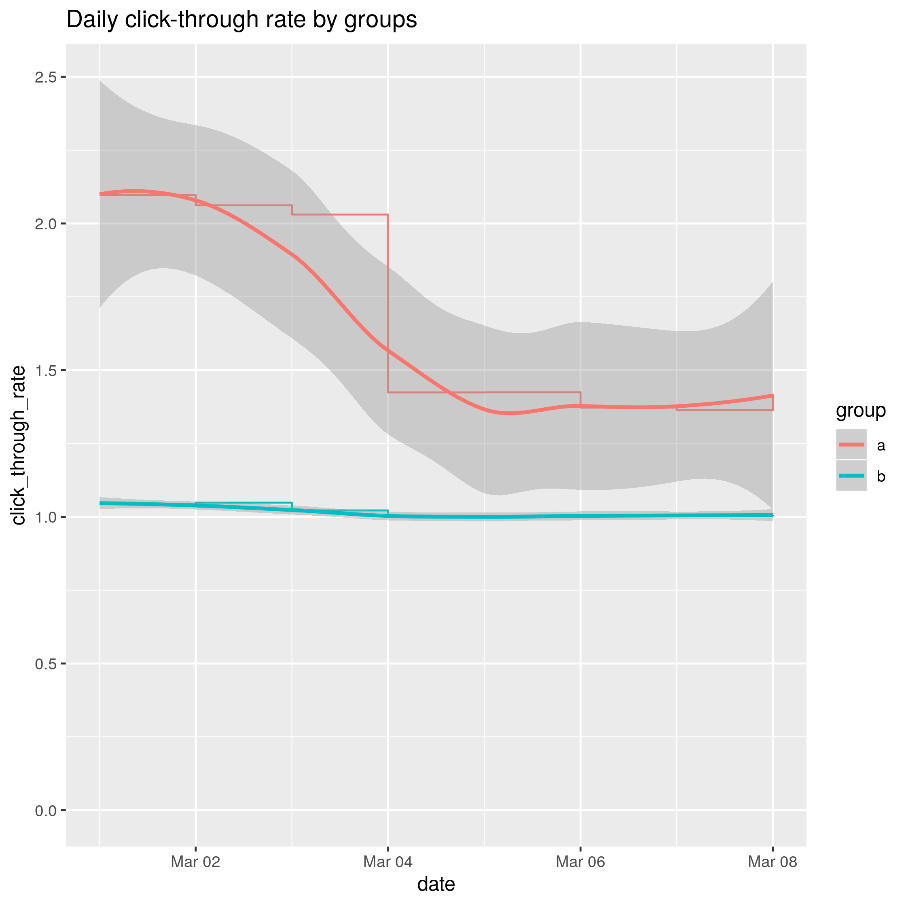
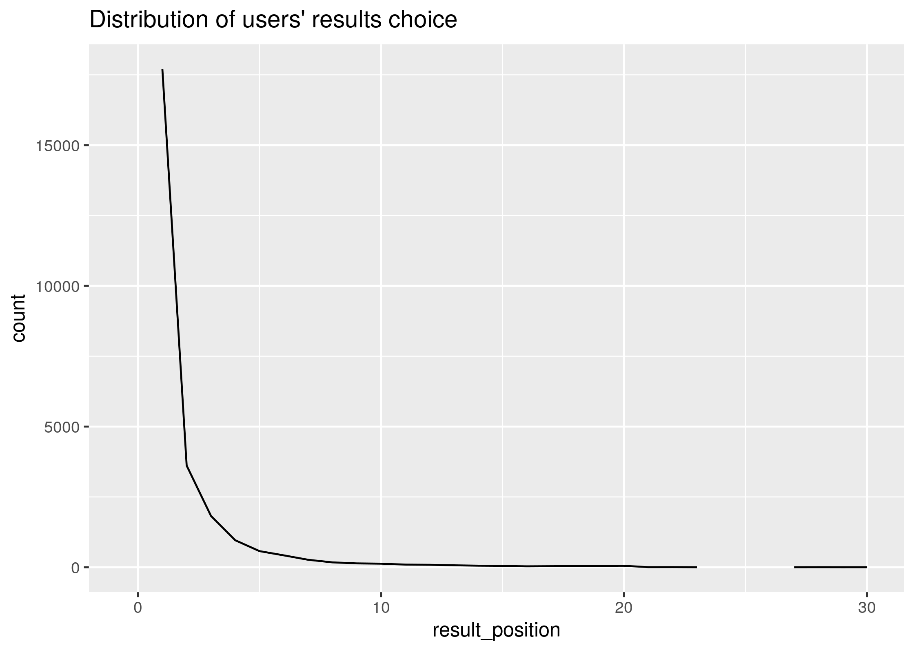
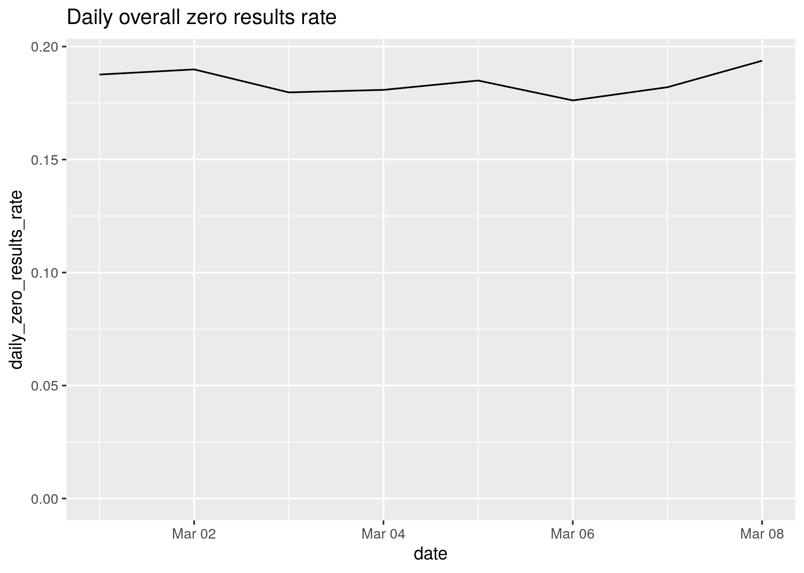
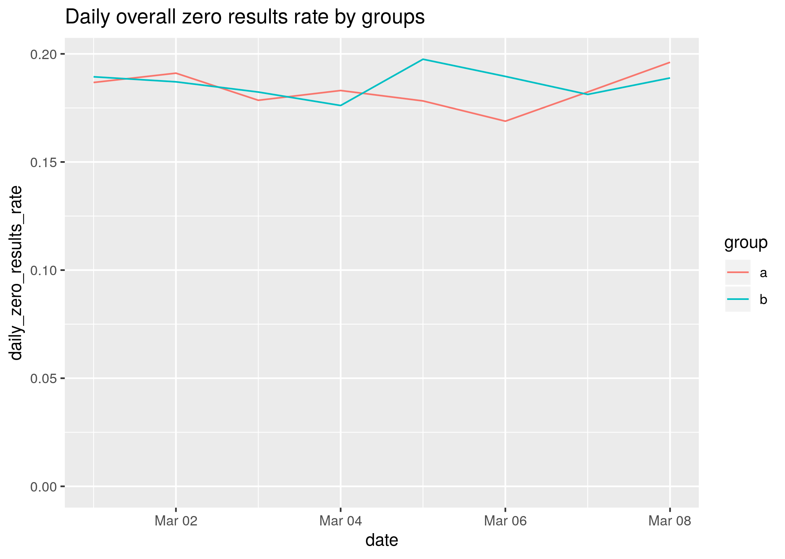
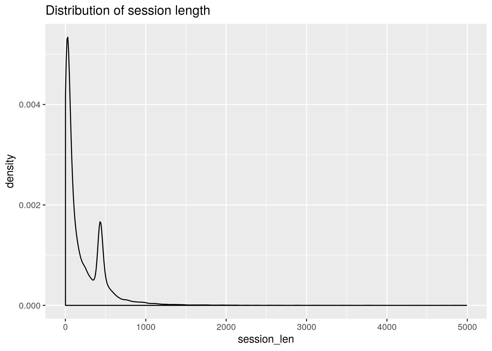
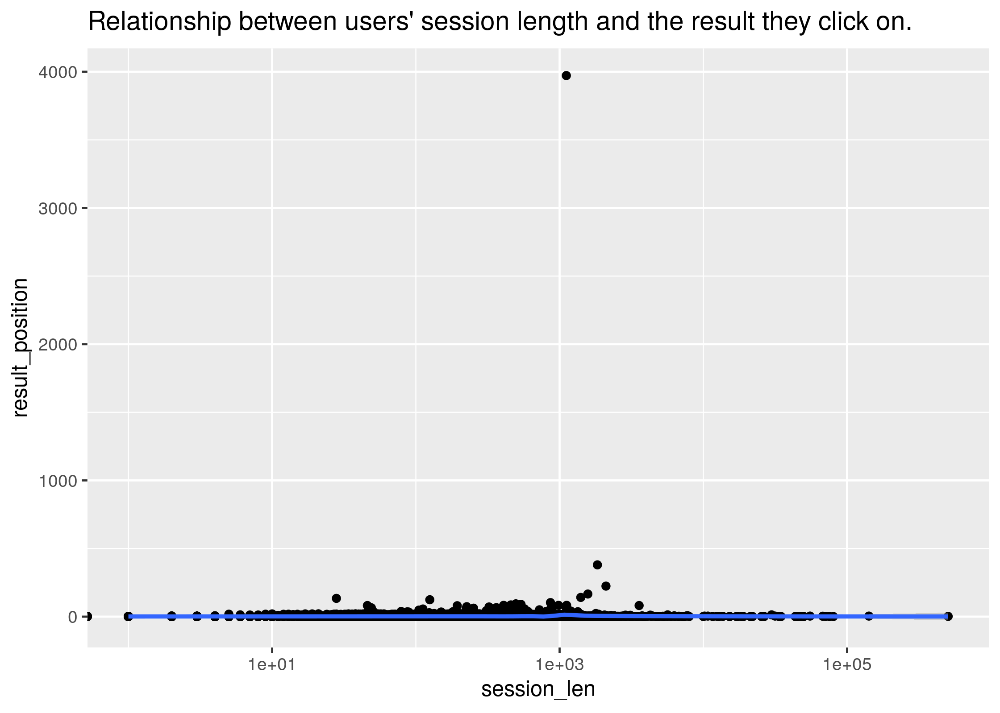

Task description and data for candidates applying to be a Data Analyst in the [Discovery department](https://www.mediawiki.org/wiki/Wikimedia_Discovery) at [Wikimedia Foundation](https://wikimediafoundation.org/wiki/Home).

## Background

Discovery (and other teams within the Foundation) rely on *event logging* (EL) to track a variety of performance and usage metrics to help us make decisions. Specifically, Discovery is interested in:

- *clickthrough rate*: the proportion of search sessions where the user clicked on one of the results displayed
- *zero results rate*: the proportion of searches that yielded 0 results

and other metrics outside the scope of this task. EL uses JavaScript to asynchronously send messages (events) to our servers when the user has performed specific actions. In this task, you will analyze a subset of our event logs.

\* Given dependencies and other instructions, we should be able to re-run your source code with the dataset in the same directory and obtain the same results and figures. Popular formats for this include RMarkdown and Jupyter Notebook (formerly IPython).

**Note**: if you submit your report as a Jupyter/IPython notebook on Greenhouse, please upload a copy to GitHub and include the link when you submit it on Greenhouse.

## Data

The dataset comes from a [tracking schema](https://meta.wikimedia.org/wiki/Schema:TestSearchSatisfaction2) that we use for assessing user satisfaction. Desktop users are randomly sampled to be anonymously tracked by this schema which uses a "I'm alive" pinging system that we can use to estimate how long our users stay on the pages they visit. The dataset contains just a little more than a week of EL data.

| Column          | Value   | Description                                                                       |
|:----------------|:--------|:----------------------------------------------------------------------------------|
| uuid            | string  | Universally unique identifier (UUID) for backend event handling.                  |
| timestamp       | integer | The date and time (UTC) of the event, formatted as YYYYMMDDhhmmss.                |
| session_id      | string  | A unique ID identifying individual sessions.                                      |
| group           | string  | A label ("a" or "b").                                     |
| action          | string  | Identifies in which the event was created. See below.                             |
| checkin         | integer | How many seconds the page has been open for.                                      |
| page_id         | string  | A unique identifier for correlating page visits and check-ins.                    |
| n_results       | integer | Number of hits returned to the user. Only shown for searchResultPage events.      |
| result_position | integer | The position of the visited page's link on the search engine results page (SERP). |

The following are possible values for an event's action field:

- **searchResultPage**: when a new search is performed and the user is shown a SERP.
- **visitPage**: when the user clicks a link in the results.
- **checkin**: when the user has remained on the page for a pre-specified amount of time.

### Example Session

|uuid                             |      timestamp|session_id       |group |action           | checkin|page_id          | n_results| result_position|
|:--------------------------------|:--------------|:----------------|:-----|:----------------|-------:|:----------------|---------:|---------------:|
|4f699f344515554a9371fe4ecb5b9ebc | 20160305195246|001e61b5477f5efc |b     |searchResultPage |      NA|1b341d0ab80eb77e |         7|              NA|
|759d1dc9966353c2a36846a61125f286 | 20160305195302|001e61b5477f5efc |b     |visitPage        |      NA|5a6a1f75124cbf03 |        NA|               1|
|77efd5a00a5053c4a713fbe5a48dbac4 | 20160305195312|001e61b5477f5efc |b     |checkin          |      10|5a6a1f75124cbf03 |        NA|               1|
|42420284ad895ec4bcb1f000b949dd5e | 20160305195322|001e61b5477f5efc |b     |checkin          |      20|5a6a1f75124cbf03 |        NA|               1|
|8ffd82c27a355a56882b5860993bd308 | 20160305195332|001e61b5477f5efc |b     |checkin          |      30|5a6a1f75124cbf03 |        NA|               1|
|2988d11968b25b29add3a851bec2fe02 | 20160305195342|001e61b5477f5efc |b     |checkin          |      40|5a6a1f75124cbf03 |        NA|               1|

This user's search query returned 7 results, they clicked on the first result, and stayed on the page between 40 and 50 seconds. (The next check-in would have happened at 50s.)

---

## Task

You must create a **reproducible report** answering the following questions:

```r
#setwd("./Discovery-Hiring-Analyst-2016/")
# Creating a separate folder for output files.
if(dir.exists("./output/") == FALSE){
  dir.create("./output/")
}
  # Loading packages
  library(tidyverse)
  library(lubridate)
```


```r
  events <- read.csv("events_log.csv.gz", header = T, stringsAsFactors = F)
  # Checking data loaded
  str(events) # Show dimensions of the data frame and its variables. The output shows data types of each variable are consistent with the table provided (see Data section).
```

```
## 'data.frame':	400165 obs. of  9 variables:
##  $ uuid           : chr  "00000736167c507e8ec225bd9e71f9e5" "00000c69fe345268935463abbfa5d5b3" "00003bfdab715ee59077a3670331b787" "0000465cd7c35ad2bdeafec953e08c1a" ...
##  $ timestamp      : num  2.02e+13 2.02e+13 2.02e+13 2.02e+13 2.02e+13 ...
##  $ session_id     : chr  "78245c2c3fba013a" "c559c3be98dca8a4" "760bf89817ce4b08" "fb905603d31b2071" ...
##  $ group          : chr  "b" "a" "a" "a" ...
##  $ action         : chr  "searchResultPage" "searchResultPage" "checkin" "checkin" ...
##  $ checkin        : int  NA NA 30 60 30 180 240 NA 180 150 ...
##  $ page_id        : chr  "cbeb66d1bc1f1bc2" "eb658e8722aad674" "f99a9fc1f7fdd21e" "e5626962a6939a75" ...
##  $ n_results      : int  5 10 NA NA NA NA NA 15 NA NA ...
##  $ result_position: int  NA NA NA 10 NA NA NA NA 1 1 ...
```

```r
  summary(events) # Get a hint of the data stored by each variable.
```

```
##      uuid             timestamp          session_id           group          
##  Length:400165      Min.   :2.016e+13   Length:400165      Length:400165     
##  Class :character   1st Qu.:2.016e+13   Class :character   Class :character  
##  Mode  :character   Median :2.016e+13   Mode  :character   Mode  :character  
##                     Mean   :2.016e+13                                        
##                     3rd Qu.:2.016e+13                                        
##                     Max.   :2.016e+13                                        
##                                                                              
##     action             checkin         page_id            n_results     
##  Length:400165      Min.   : 10.00   Length:400165      Min.   :  0.00  
##  Class :character   1st Qu.: 20.00   Class :character   1st Qu.:  2.00  
##  Mode  :character   Median : 50.00   Mode  :character   Median : 20.00  
##                     Mean   : 97.19                      Mean   : 13.21  
##                     3rd Qu.:150.00                      3rd Qu.: 20.00  
##                     Max.   :420.00                      Max.   :500.00  
##                     NA's   :176341                      NA's   :263931  
##  result_position  
##  Min.   :   1.00  
##  1st Qu.:   1.00  
##  Median :   1.00  
##  Mean   :   2.99  
##  3rd Qu.:   2.00  
##  Max.   :4103.00  
##  NA's   :169683
```

```r
  head(events) # Print out a handful of observations to inspect them.
```

```
##                               uuid    timestamp       session_id group
## 1 00000736167c507e8ec225bd9e71f9e5 2.016030e+13 78245c2c3fba013a     b
## 2 00000c69fe345268935463abbfa5d5b3 2.016031e+13 c559c3be98dca8a4     a
## 3 00003bfdab715ee59077a3670331b787 2.016030e+13 760bf89817ce4b08     a
## 4 0000465cd7c35ad2bdeafec953e08c1a 2.016030e+13 fb905603d31b2071     a
## 5 000050cbb4ef5b42b16c4d2cf69e6358 2.016030e+13 c2bf5e5172a892dc     a
## 6 0000a6af2baa5af1be2431e84cb01da1 2.016030e+13 f6840a9614c527ad     a
##             action checkin          page_id n_results result_position
## 1 searchResultPage      NA cbeb66d1bc1f1bc2         5              NA
## 2 searchResultPage      NA eb658e8722aad674        10              NA
## 3          checkin      30 f99a9fc1f7fdd21e        NA              NA
## 4          checkin      60 e5626962a6939a75        NA              10
## 5          checkin      30 787dd6a4c371cbf9        NA              NA
## 6          checkin     180 6fb7b9ea87012975        NA              NA
```

### **1. What is our daily overall clickthrough rate?**

Transforming timestamp variable into a date-time formatted variable, stored as 'time'.

```r
events$time <- as.POSIXct(strptime(x = events$timestamp, format = "%Y%m%d%H%M%S"))

events$date <- lubridate::date(events$time)

events <- arrange(events, session_id, time)
```
Four cases were not properly transformed because the timestamp did not meet the formatting requirements. Here those 4 rogue cases are shown:

```r
filter(events,is.na(events$time))
```

```
##                               uuid    timestamp       session_id group
## 1 8d8ffe3bfba4516f9d0d8c1decbe1b76 2.016031e+13 13cd6d70d0fa2b58     a
## 2 1a5b663f6a1258f588dc4de65c90b5c0 2.016030e+13 35a29e7a78ccc24b     a
## 3 deac7c11f00d598292f9e18ee2f6997f 2.016030e+13 426b242692d66473     a
## 4 6509e446fe7852fbb503af7d3453c6df 2.016031e+13 aa89be8089ff5694     a
##             action checkin          page_id n_results result_position time date
## 1          checkin     120 041d0e94cde215fd        NA               1 <NA> <NA>
## 2          checkin     180 8f0d489715dd14b0        NA              NA <NA> <NA>
## 3 searchResultPage      NA 2ab3d9ca41b16173        20              NA <NA> <NA>
## 4          checkin     420 2ba84fc2f11fbc92        NA               1 <NA> <NA>
```

```r
time_missing <- round(sum(is.na(events$time))/nrow(events) * 100, 6)
```

However, given that it is a minor issue affecting 0.001 % of cases, we will continue the analysis.

The following code finds the click-through rate for each day in the data set and plots it.  The results show an average CTR of 6, with some variation over time. That variation comes as a descend in the CTR from the 4th of March onwards.

```r
# Data transformation
CTR <- events %>%
            group_by(date) %>%
            summarise("click_through_rate" = n()/
                        n_distinct(session_id))
# Graphical representation
ggplot(CTR, aes(x = date, y = click_through_rate)) + 
  geom_step() +
  ylim(c(0,NA)) +
  geom_smooth() +
  labs(title = "Daily click-through rate")
```

```
## `geom_smooth()` using method = 'loess' and formula 'y ~ x'
```

<!-- -->

```r
ggsave("./output/1-ctr-daily.png", plot = last_plot(),
         dpi = 320)
```

```
## Saving 7 x 5 in image
## `geom_smooth()` using method = 'loess' and formula 'y ~ x'
```

```r
# Further comparison
mean_start <- mean(CTR[which(CTR$date < date("2016-03-04")), "click_through_rate"][[1]])
mean_end <- mean(CTR[which(CTR$date >= date("2016-03-04")), "click_through_rate"][[1]])
```

The three first days of the study users were ~19% more likely to click-through results than later in the period.


### **How does it vary between the groups?**  

```r
# Data transformation
CTRab <- events %>%
            group_by(group, date) %>%
            filter(action == "visitPage") %>% 
            summarise("click_through_rate" = n()/
                        n_distinct(session_id))

# Graphical representation
CTRab %>% 
  ggplot(aes(x = date, y = click_through_rate, colour = group)) + 
  geom_step() +
  ylim(c(0,NA)) +
  geom_smooth() +
  labs(title = "Daily click-through rate by groups")
```

```
## `geom_smooth()` using method = 'loess' and formula 'y ~ x'
```

<!-- -->

```r
ggsave("./output/1-ctr-daily-groups.png", plot = last_plot(),
         dpi = 320)
```

```
## Saving 7 x 5 in image
## `geom_smooth()` using method = 'loess' and formula 'y ~ x'
```


```r
# Further comparison
t_test <- t.test(CTRab$click_through_rate[CTRab$group == "a"],
       CTRab$click_through_rate[CTRab$group == "b"])

# Graphical representation
CTRab %>% 
  group_by(group) %>% 
  summarise(mean_CTR = mean(click_through_rate)) %>% 
  ungroup() %>% 
  ggplot(aes(x = group, y = mean_CTR, colour = group)) +
  geom_boxplot() +
  ylim(c(0,NA)) +
  labs(title = "Overall click-through rate by groups")
```

<!-- -->

The **CTR differs clearly among** the two **groups** of users assigned as we can see in the graph. The statistical t test reports a *p-value* of 0.001, which means that difference between groups is statistically significant overall (for a confidence level of 95%).

Furthermore, when analysing groups and days at the same time, it is clear how the change in CTR detected over the days is completely due to the behaviour of users from **group A**. In other words, the change in CTR observed is an interaction between the variables `date` and `group`. Users from **group B** did not experiment any significant variation in their CTR, staying away from the overall trend--that is also a consequence of the larger size of group A compared to group B.

### **2. Which results do people tend to try first?** 
That is, what is the most common result_position for the oldest visitPage action of each session_id.

```r
# Data transformation
first_try <- events %>%
  filter(action == "visitPage") %>%
  group_by(session_id) %>%
  mutate(first_result = min(time, na.rm=T)) %>%
  filter(time == first_result) %>% 
  select(result_position)
```

```
## Adding missing grouping variables: `session_id`
```

```r
# Graphical representation
first_try %>% 
  ggplot() +
  geom_freqpoly(aes(x = result_position)) +
  xlim(c(NA,30)) + # Upper limit set after seeing the unfiltered result.
  ylim(c(1,NA)) +
  labs(title = "Distribution of users' results choice")
```

```
## `stat_bin()` using `bins = 30`. Pick better value with `binwidth`.
```

<!-- -->

```r
ggsave("./output/2-first_result.png", plot = last_plot(),
         dpi = 320)
```

```
## Saving 7 x 5 in image
## `stat_bin()` using `bins = 30`. Pick better value with `binwidth`.
```

```r
# Further analysis
result_position_share <- first_try %>% 
 group_by(result_position) %>% 
 summarise(share = n() / nrow(filter(events, action == "visitPage")))
```
Users tend to **choose the first result** offered by the search engine of this study much more than any other option. The concentration of clicks in the first result, along with the rapid decrease in the number of times the following results are chosen depict a distribution similar to that of function like 
$y = \frac{1}{\sqrt{X}}$. 

Additionally, it is worth mention how the attention of users seems to **focus on the last 3 results once they have discarded the first 20**. This phenomenom can be seen in the graph as a jump in the line, indicating no registers for clicks on the 23th to 27th results. This could be further studied using data from users' scroll behaviour, if available.

### **How does it change day-to-day?**

```r
# Data transformation
daily_first_try <- events %>%
  filter(action == "visitPage") %>%
  group_by(date, session_id) %>%
  mutate(first_result = min(time, na.rm=T)) %>%
  filter(time == first_result) %>% 
  select(result_position)
```

```
## Adding missing grouping variables: `date`, `session_id`
```

```r
# Graphical representation
daily_first_try %>% 
  ggplot() +
  geom_freqpoly(aes(x = result_position)) +
  xlim(c(NA,30)) + # Upper limit set after seeing the unfiltered result.
  ylim(c(1,NA)) +
  labs(title = "Distribution of results chosen by day") +
  facet_grid(date ~ .) +
  theme(text = element_text(size=8))
```

```
## `stat_bin()` using `bins = 30`. Pick better value with `binwidth`.
```

<!-- -->

```r
ggsave("./output/2-first_result-daily.png", plot = last_plot(),
         dpi = 320)
```

```
## Saving 7 x 5 in image
## `stat_bin()` using `bins = 30`. Pick better value with `binwidth`.
```

This graph does not show relevant differences in the position of search results chosen by day. The graph shows total number of clicks and not relative values within each day, so the y values are influenced by the number of users and sessions active each day. Nonetheless, the main change across days is the intermittency of the phenomenom earlier described of late results being more prominent than the penultimate bunch.

### **3. What is our daily overall *zero results rate*(ZRR)?**  
Proportion of action == "searchResultPage" for which n_results == 0, calculated for each day.

```r
# Data transformation
ZRR <- events %>% 
    group_by(date) %>%
    filter(action == "searchResultPage") %>% 
    select(date, n_results, action) %>% 
    mutate(daily_zero_results = sum(n_results == 0))

# Graphical representation
ZRR %>% 
  group_by(date) %>%
  summarise(daily_zero_results_rate = mean(daily_zero_results) / n()) %>% 
  ggplot(aes(x = date, y = daily_zero_results_rate)) +
  geom_line() +
  labs(title = "Daily overall zero results rate")
```

<!-- -->

```r
ggsave("./output/3-zrr-daily.png", plot = last_plot(),
         dpi = 320)
```

```
## Saving 7 x 5 in image
```

```r
# Exportation
avg_ZRR <- ZRR %>% 
  group_by(date) %>%
  summarise(daily_zero_results_rate = mean(daily_zero_results) / n()) %>% 
  filter(!is.na(date)) %>% 
  summarise(mean(daily_zero_results_rate))
```

Consistent ZRR of 0.18 across the time of the study. The variations present are small and do not resemble the trends found for the CTR metrics.

### **How does it vary between the groups?**

```r
# Data transformation
ZRRab <- events %>% 
    group_by(date,group) %>%
    filter(action == "searchResultPage") %>% 
    select(date, n_results, action) %>% 
    mutate(daily_zero_results = sum(n_results == 0))
```

```
## Adding missing grouping variables: `group`
```

```r
# Graphical representation
ZRRab %>% 
  group_by(date,group) %>%
  summarise(daily_zero_results_rate = mean(daily_zero_results) / n()) %>% 
  ggplot(aes(x = date, y = daily_zero_results_rate, colour = group)) +
  geom_line() +
  labs(title = "Daily overall zero results rate by groups")
```

<!-- -->

```r
ggsave("./output/3-zrr-daily-groups.png", plot = last_plot(),
         dpi = 320)
```

```
## Saving 7 x 5 in image
```

In a similar fashion than in the previous question, ZRR does not seem to be affected by group assignation either. The daily ZRR is quite robust for both groups and all the days considered around 0.18.

### **4. Let *session length* be approximately the time between the first event and the last event in a session. Choose a variable from the dataset and describe its relationship to session length. Visualize the relationship.**  
First we create the new variable `session_len` for *session length*:  

```r
# Data transformation
# Creation of session length variable (in seconds)
events <- events %>%
  group_by(session_id) %>% 
  mutate(session_len = time_length(max(time, na.rm=T) - min(time, na.rm=T)))
```

An initial exploration of this new variable provides some useful information.

```r
summary(events$session_len)
```

```
##     Min.  1st Qu.   Median     Mean  3rd Qu.     Max. 
##      0.0     82.0    339.0    653.6    475.0 504879.0
```

```r
upper_threshold <- 5000

valid_session_len <- function(upper_threshold){
 (1 - nrow(filter(events, session_len > upper_threshold)) / nrow(events)) * 100
}
```
The new variable `session_len` is heavily skewed to the left, with a distribution similar to a log normal one. In the following graph we will exclude extreme cases (i.e. those with a session lenght greater than 5000 seconds--approximately 1.39 hours). The long-tail distribution implies that we will be still working with 99.384% of cases.


```r
# Graphical representation
events %>% 
  group_by(session_id) %>% 
  summarise(session_len = max(session_len)) %>% 
  filter(session_len > 0 & session_len < upper_threshold) %>% 
  ggplot(aes(x = session_len)) +
  geom_density() +
  labs(title = "Distribution of session length")
```

<!-- -->

```r
ggsave("./output/4-session_len-hist.png", plot = last_plot(),
         dpi = 320)
```

```
## Saving 7 x 5 in image
```

```r
events %>% 
  group_by(session_len) %>% 
  summarise(n_session_len = n()) %>% 
  arrange(desc(n_session_len))
```

```
## # A tibble: 1,578 x 2
##    session_len n_session_len
##          <dbl>         <int>
##  1           0         27618
##  2         423          5491
##  3         424          4915
##  4         425          4035
##  5         426          3881
##  6         429          3380
##  7         427          3318
##  8         428          3300
##  9         430          2963
## 10         422          2746
## # … with 1,568 more rows
```
The distribution shows an interesting pattern: the most common case is that of users spending zero seconds at the site. This could be due to external calls to the server via API or other kind of technology-related feature. Further research is needed to fully understand that result.
On top of that, the second most interesting thing is that sessions of approximately 420 seconds (i.e. 7 minutes) represent a local maximum. The values preceeding `session_len` of 423 seconds are the only ones with a positive relationship with $y$. Then, 92.459% of total sessions are over aver 1,000 seconds (16.67 minutes), despite registering extreme values as large as 5.04879\times 10^{5}.


Now, I would like to explore wether there is a relationship between the session length and the result chosen by the user. Is it sensible to think users spending more time at the site are more likely to have clicked on results furter into the results page?


```r
SL <- events %>%
  group_by(session_id) %>%
  select(result_position, session_len) %>% 
  filter(!is.na(result_position)) %>% 
  summarise_each(funs(median))
```

```
## Adding missing grouping variables: `session_id`
```

```r
SL %>% 
  ggplot(aes(x = session_len, y = result_position))+
  geom_point() +
  stat_smooth(method = "gam", formula = y ~ s(x, bs = "cs")) + 
  scale_x_log10() +
  labs(title = "Relationship between users' session length and the result they click on.")
```

<!-- -->

```r
ggsave("./output/4-session_len-vs-result_position.png", plot = last_plot(),
         dpi = 320)
```

```
## Saving 7 x 5 in image
```

The initial graphical representation does not show important interactions between the two variables.


```r
model_fit <- lm(result_position ~ session_len, data = SL, method = "gam")

plot(model_fit)
```

<!-- --><!-- --><!-- --><!-- -->

These second group of graphs show that there is no interesting relationship between the time spent by a given user in a session and the further down she may look for a relevant search engine result.

### **5. Summarize your findings in an executive summary.**  

Over the period from 2016-03-01 to 2016-03-08, these are the main insights we can extract from the users' behaviours at the analysed web site:  

* The click-through rate (**CTR**) scored an average of 6, with some variation over time. That variation comes as a descend in the CTR from the 4th of March onwards.


* The **CTR differs clearly among** the two **groups** of users assigned as we can see in the graph. The statistical t test reports a *p-value* of 0.001, which means that difference between groups is statistically significant overall (for a confidence level of 95%).  
The change in CTR detected over the days is completely due to the behaviour of users from **group A**. Users from **group B** did not experiment any significant variation in their CTR, staying away from the overall trend.


* Regarding the position of results most clicked by users in their first try after a search, it is important to **note that 44.14% of users clicked on the first result** after performing a websearch query. The graph below shows the distribution of cases, highly concentrated on the first positions of the search engine results page (SERP). Also, a small group of users show a tendency to focus on the last 3 elements of the list more than they do on results listed between the 23th and the 27th element.


* The zero results rate (**ZRR**) of **0.18 was stable** across the study, with no significant changes over time nor across groups. The variations present are small and do not resemble those trends found for the CTR metrics.  



* Analysing the **session length** of users at the site we found an an interesting pattern: the most common case is that of users spending zero seconds at the site. This could be due to external calls to the server via API or other kind of technology-related feature. Then, the second most interesting point is that sessions of approximately 420 seconds (i.e. 7 minutes) represent a local maximum.

* There is **no proven relationship** between the time spent by a given user in a session and the **position of the search engine result selected** by her, as illustrated by the following graph.

*

| *Latest update:* |  
|-----------------:|  
| Mon Jan 27 19:44:31 2020       |
